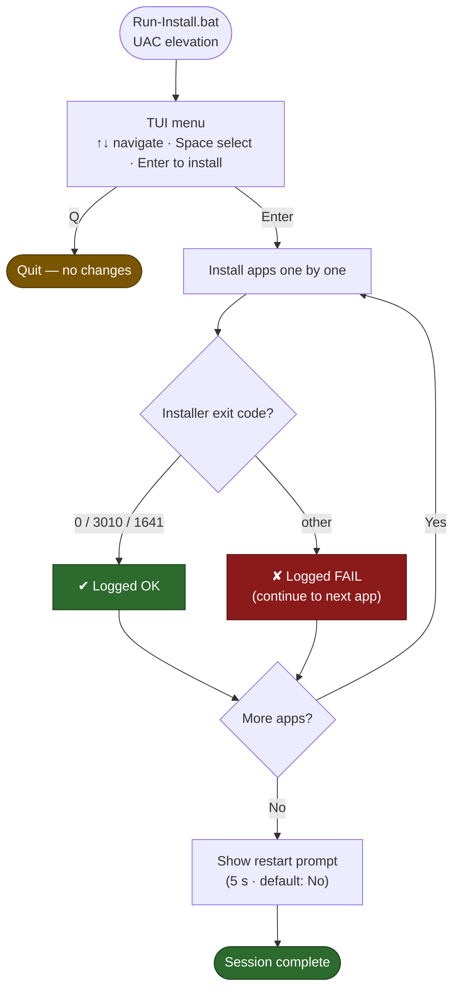

# Install-EssentialApps

<!-- BADGES:START -->
[](LICENSE) [](https://learn.microsoft.com/en-us/powershell/) [](https://www.microsoft.com/windows) [](https://github.com/5a9awneh/Install-EssentialApps/commits) [](https://github.com/5a9awneh/Install-EssentialApps)
<!-- BADGES:END -->

An interactive terminal UI for bulk-installing software on fresh Windows machines. Select only what you need, run once, walk away.

---

```
Software Installer
Select applications to install:

> [ ] Acrobat Reader
  [ ] Google Chrome
  [ ] Teams
  [ ] K-Lite Codec Pack
  [ ] 7-Zip
  [ ] Microsoft Office 365
  [ ] Azure Information Protection Viewer
  [ ] .NET Desktop Runtime
  [ ] Dell SupportAssist

----------------------------------
  [Space]       Select/Deselect
  [Up/Down]     Move up/down
  [Enter]       Install
  [q]           Quit
```



---

## ✅ Requirements

- Windows 10 / 11
- Administrator rights — `Run-Install.bat` handles UAC elevation automatically
- Installer files placed under `Software\Essentials\` next to the script (see **Customizing the App List** below)

---

## 🚀 Usage

1. Copy the script folder (including `Software\Essentials\` with your installers) to the target machine — USB, network share, or local disk all work.
2. Double-click **`Run-Install.bat`** and accept the UAC prompt.
3. Use **↑ / ↓** to navigate, **Space** to select or deselect apps, **Enter** to begin installation.
4. Answer the restart prompt when done (default: no restart).

> If you decline the UAC prompt, the script will display a message and wait — it will not silently close.

---

## 📦 Customizing the App List

The `$applications` array near the top of `Install-EssentialApps.ps1` defines what appears in the menu. Each entry is a hashtable with three keys:

| Key | Description |
|-----|-------------|
| `Name` | Display name shown in the menu |
| `Path` | Path to the installer, relative to the script folder |
| `Args` | Silent install arguments passed to the installer |

**Adding an app** — copy any existing entry and update all three keys.

**Disabling without removing** — prefix the entry with `#` to comment it out. It stays in the file for reference.

All `Path` values resolve relative to `$PSScriptRoot` — the folder containing the script — so the same script works from a USB drive, a network share, or a local path without changes.

### 🔇 Silent Install Arguments

Silent arguments suppress the installer UI so no clicks are required. How to find them:

| Method | Details |
|--------|---------|
| **Help flag** | Run `installer.exe /?` or `installer.exe --help` in a terminal |
| **MSI-based** | `/quiet /norestart` (fully silent) or `/qb! /norestart` (minimal UI) |
| **NSIS-based** | `/S` |
| **Inno Setup** | `/VERYSILENT /NORESTART /SUPPRESSMSGBOXES` |
| **WiX / Burn** | `/quiet` or `/silent` |
| **Vendor docs** | Search `<app name> silent install parameters` or `unattended install` |
| **Reference** | [ss64.com — msiexec flags](https://ss64.com/nt/msiexec.html) · [silentinstallhq.com](https://silentinstallhq.com) |

> **Exit codes:** `0` = success. `3010` = success, reboot required. `1641` = reboot already initiated. Any other code is treated as a failure and logged.

---

## ⚙️ How It Works

1. The TUI menu loops until at least one app is selected and Enter is pressed.
2. Selected apps are passed to `Install-Application` one by one.
3. Each installer is launched with `Start-Process -Wait` — the script blocks until the process exits.
4. The installer's exit code is checked; anything outside the known success codes is thrown as an error.
5. A progress bar tracks overall completion.
6. On finish, a 5-second restart prompt appears (default: no restart).

---

## 📋 Logging

Every session appends to `Install-EssentialApps.log` in the same folder as the script:

```
2026-05-03 14:00:01  --- Install session started ---
2026-05-03 14:00:01  START  Google Chrome
2026-05-03 14:00:08  OK     Google Chrome
2026-05-03 14:00:08  START  7-Zip
2026-05-03 14:00:09  FAIL   7-Zip — File not found: ...
2026-05-03 14:01:30  --- Session complete: 1/2 installed ---
```

Log entries older than 90 days are automatically trimmed at the start of each session. The log file is excluded from the repo via `.gitignore`.

---

## ⚠️ Notes

- **ASCII art** — A placeholder comment in `Display-Menu` marks where you can drop in your own `Write-Host @"..."@` art block.
- **Dell Command Update** — The entry and its post-install configuration function (`Configure-DellCommandUpdate`) are present but commented out. To activate, uncomment the `$applications` entry and the `Configure-DellCommandUpdate` call inside `Install-Application`.
- **Teams sideload** — The Teams entry uses the bootstrapper + `.msix` sideload method. Both `teamsbootstrapper.exe` and `MSTeams-x64.msix` must be present in `Software\Essentials\`.
